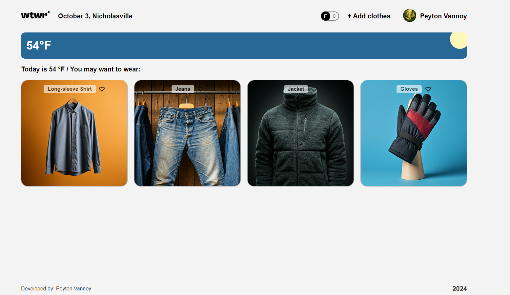
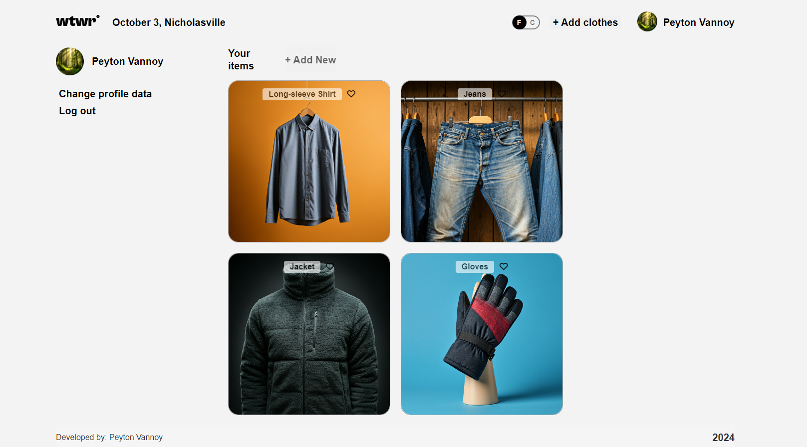

# WTWR (What to Wear?) 🧥☀️❄️

Domain name: [https://wtwr.ohbah.com](https://wtwr.ohbah.com)

## Your Personal Weather-Based Wardrobe Assistant

WTWR is an innovative application that takes the guesswork out of dressing for the weather. By combining real-time weather data with your personal wardrobe, WTWR suggests the perfect outfit for any day, any weather, anywhere.

## 🌟 Features

- **Smart Outfit Suggestions**: Get personalized clothing recommendations based on current weather conditions.
- **Virtual Wardrobe**: Upload and manage your clothing items with ease.
- **Weather Integration**: Real-time weather data ensures your outfit always matches the conditions outside.
- **User Profiles**: Create and customize your profile to get more accurate suggestions.
- **Responsive Design**: Seamless experience across all your devices. (coming soon...)

## 🛠 Tech Stack

- **Frontend**: React.js
- **Backend**: Express.js, Node.js
- **Database**: MongoDB with Mongoose ODM
- **Authentication**: JWT for secure user sessions

## 🚀 Quick Start

1. Clone the repo:

   ```
   git clone https://github.com/Peyton-vannoy/se_project_react.git
   git clone https://github.com/Peyton-vannoy/se_project_express.git
   ```

2. Install dependencies for both frontend and backend:

   ```
   cd se_project_react && npm install
   cd ../se_project_express && npm install
   ```

3. Set up your environment variables (see `.env.example` in both directories).

4. Start the backend server:

   ```
   cd se_project_express && npm run dev
   ```

5. In a new terminal, start the frontend:

   ```
   cd se_project_react && npm run dev
   ```

6. Open your browser and navigate to `https://wtwr.ohbah.com`. Welcome to WTWR!

## 📸 Screenshots


_WTWR Dashboard: Your daily outfit suggestion at a glance_


_Easily manage your virtual wardrobe_

## 📞 Contact

Peyton Vannoy - [peyton.vannoy1999@gmail.com](mailto:vannoypeyton819@gmail.com)

Project Links:

- Frontend: [https://github.com/Peyton-vannoy/se_project_react](https://github.com/Peyton-vannoy/se_project_react)
- Backend: [https://github.com/Peyton-vannoy/se_project_express](https://github.com/Peyton-vannoy/se_project_express)

---

Never be underdressed or overdressed again. Let WTWR be your personal stylist, every single day! 🌞🌧️❄️
